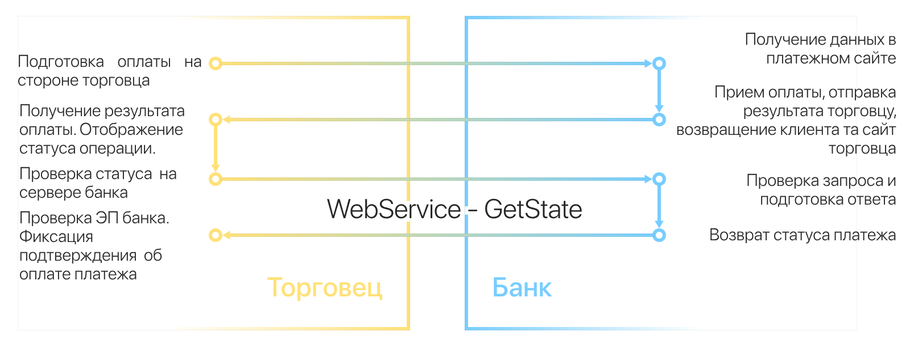
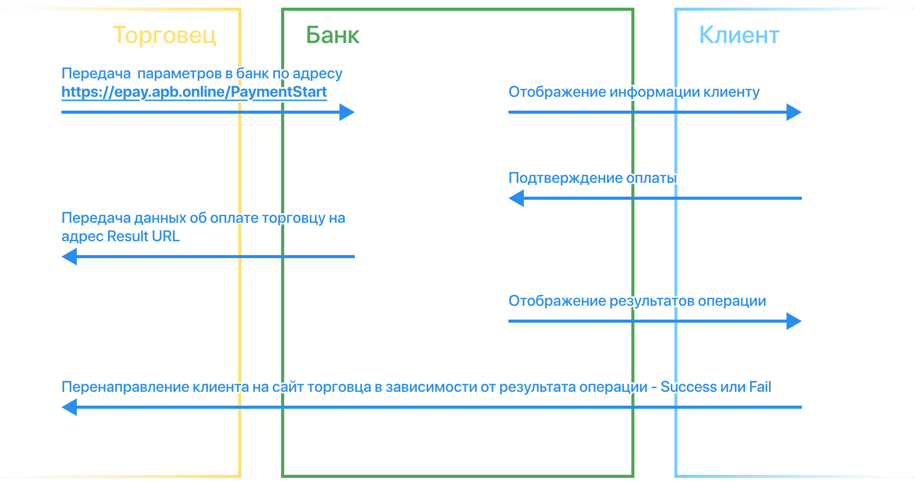
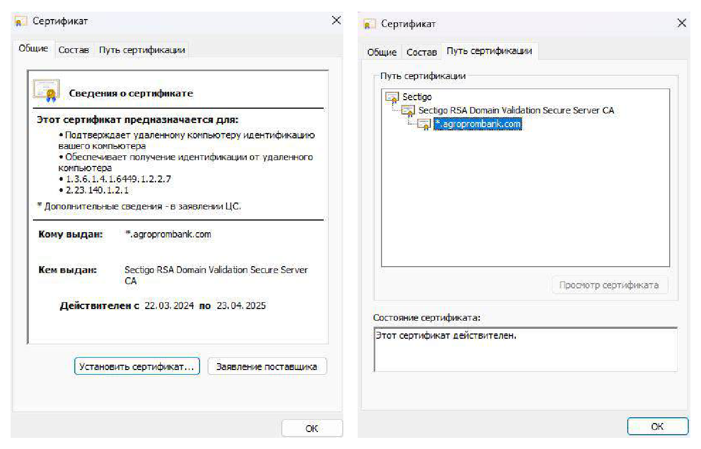

> **О файле.** Это дословное воспроизведение документа «Техническое описание настройки Интернет-магазина», v2.0, ЗАО «Агропромбанк», 2025 г. (файл `WebPayment-Документация.pdf`, 23 страницы). Текст, названия параметров, примеры, числа и знаки перенесены без изменений, **включая опечатки и неточности оригинала** (например, «транкзации», «служиться», «торговка», «Уточнять в банке», повторяющиеся номера «3» в таблицах подписи, два раздела с номером «5.»). Колонтитулы страниц («Техническое описание настройки Интернет-магазина», «v2.0 | 2025 г.», номер страницы) опущены; границы страниц отмечены комментариями вида `<!-- PDF, страница N -->`.
>
> Всё, что добавлено при оформлении и не является текстом документа, набрано *курсивом* или спрятано в комментариях: пометки «в оригинале набрано красным», «Текст на рисунке», «Продолжение таблицы», а также рисунки из PDF (`images/`). Абзацы, которые в оригинале набраны красным, оформлены цитатой.


<!-- ===== PDF, страница 1 (титульная) ===== -->

АГРОПРОМБАНК

_(Так подписан логотип на обложке.)_

ТЕХНИЧЕСКАЯ ДОКУМЕНТАЦИЯ

# Техническое описание настройки Интернет-магазина

v2.0

ЗАО «Агропромбанк» | 2025 г.

---

<!-- ===== PDF, страница 2 (номер страницы в документе: 1) ===== -->

## 1 . Общее описание сервиса

Сервис приема платежей в интернете «Web-платеж» предназначен для приема оплаты с помощью карт ПС «Клевер» на веб страницах в сети Интернет. Сервис представляет стандартное E-Commerce решение, которое предлагает прием оплаты за товары и услуги в сети интернет с помощь ввода реквизитов карты: номер карты, имя владельца карты, срок действия и CVV.

Сервис может использоваться для интернет-магазинов, продающих сайтов, маркетплейсов, билетных систем, биллинговых систем и др. Сервис поддерживает все основные платформы для использования вебсайтов: персональные компьютеры, планшеты и мобильные устройства.

Сервис состоит из двух частей: вебсайт для оплаты и веб-сервис для административных функций.

Вебсайт для оплаты использует стандартные протоколы обмена информации. Для обмена используются HTTP POST и HTTP GET запросы, а также редиректы на сайт банка и на сайт продавца. Для защиты информации используется подпись запросов и ответов. В качестве подписи используется результат HASH MD5 функции от специально подготовленной строки с информацией. Вебсайт используется только как платежный сервис.

Для управления платежами, статистикой и дополнительными возможностями используется веб-сервис. Веб сервис позволяет получать состояние платежа, получать историю платежей, управлять отменой и возвратом, устанавливать кэшбэк и др. Веб-сервис основан на использовании протокола SOAP и обмене XML запросами. Безопасность и достоверность обеспечивается со стороны клиента подписью на основе HASH MD5 функции, а со стороны банка электронной подписью.

Два сервиса работают в паре и обязательны к реализации. Правильной схемой работы сервиса является следующая:

---

<!-- ===== PDF, страница 3 (номер страницы в документе: 2) ===== -->



_Текст на рисунке. Колонка «Торговец» (слева):_

- Подготовка оплаты на стороне торговца
- Получение результата оплаты. Отображение статуса операции.
- Проверка статуса на сервере банка
- Проверка ЭП банка. Фиксация подтверждения об оплате платежа

_Текст на рисунке. По центру: «WebService - GetState». Названия колонок: «Торговец», «Банк»._

_Текст на рисунке. Колонка «Банк» (справа):_

- Получение данных в платежном сайте
- Прием оплаты, отправка результата торговцу, возвращение клиента та сайт торговца
- Проверка запроса и подготовка ответа
- Возврат статуса платежа

> Данная схема позволяет избежать подделки ответов банка, а также гарантировать получение возмещения денежных средств по платежу от банка. Если данная схема будет упрощена и в конечной реализации не будет применяться дополнительная проверка статуса и электронной подписи банка, может служиться ситуация с расхождением состояния платежа на стороне торговка и банка. Это может привести к финансовым потерям со стороны торговца.

_(В оригинале этот абзац набран красным цветом.)_

## 2 . Регистрация в сервисе

Для регистрации в сервисе торговец должен обратиться в ЗАО «Агропромбанк» для заключения соглашения о приеме платежей. При обращении торговец должен предоставить:

- Наименование интернет ресурса (до 150 символов)
- Email технической поддержки (до 80 символов)
- ResultURL - используется для оповещения торговца о результатах оплаты. Не допускается использование параметров в строке (использование & и ?)
- Метод отправки результата: POST/GET/EMAIL
- SuccessURL - используется для перенаправления пользователя на сайт торговца в случае успешной оплаты
- Метод перенаправления POST/GET
- FailURL - используется для перенаправления пользователя на сайт торговца в случае неуспешной оплаты.
- Метод перенаправления POST/GET
- Логотип интернет-ресурса (до 100 кб)
- Краткое описание интернет-ресурса

---

<!-- ===== PDF, страница 4 (номер страницы в документе: 3) ===== -->

<!-- Примечание: так в оригинале. Первый пункт списка на этой странице («Срок оплаты счета в») обрывается и повторяет начало следующего пункта; пункты «Логотип…» и «Краткое описание…» повторяют конец списка с предыдущей страницы. Текст оставлен без правок. -->

- Срок оплаты счета в
- Логотип интернет-ресурса (до 100 кб)
- Краткое описание интернет-ресурса (500 символов)
- Срок оплаты счета в минутах (30 - пол часа, 90 - полтора часа)

После регистрации, торговцу будет назначен персональный идентификатор (MerchantId) и пароль (MerchantPass, используется для формирования HASH MD5 строки параметров для формирования подписи). Также будет выслана текущая документация с примерами реализации взаимодействия.

## 3 . Инициация оплаты

Интернет-ресурс подготавливает данные для оплаты. Формируется счет на оплату с уникальным внутренним идентификатором. Идентификатор должен быть уникален на протяжении всего срока жизни данного торговца.

Торговец перенаправляет клиента на платежный сайт банка с передачей параметров подготовленного счета. Параметры могут быть переданы с помощью методов POST или GET.

URL: **https://epay.apb.online/PaymentStart**

Параметры счета.

| Переменная | Обязател. | Тип | Описание | Пример значения |
|---|---|---|---|---|
| MerchantLogin | Да | Строка | Уникальный идентификатор торговца | 000123 |
| RequestSum | Да | Число | Сумма счета в копейках. 1524 - 15 руб 24 коп | 1524 |
| RequestCurrCode | Да | Строка | Код валюты. https://www.cbpmr.net/data/2957.doc | 000 |
| nivid | Да | Строка | Уникальный идентификатор счета. Макс 20 символов. | 123456 |
| Desc | Да | Строка | Описание счета. Макс 250 символов. | Счет №123456 |
| IsTest | Да | Число | Признак теста. 0 - рабочий 1- тест | 0 |
| LifeTime | Да | Число | Время жизни счета в минутах. | 30 |
| SignatureValue | Да | Строка | Подпись запроса | 1da9133f5....0d6613c93 |
| All_Products | Нет | Строка | Перечень позиций в чеке. Только POST | Описание ниже |
| scenarioid | Нет | Число | Сценарий оплаты. Уточнять в банке | 8 |
| scenariodata | Нет | Строка | Данные сценария оплаты. Только POST | 8 |
| userecurent | Нет | Число | Генерация токена 0 - нет 1 - да | 0 |
| ispreauth | Нет | Число | Использовать предавторизацию 0 - нет 1 - да | 0 |

<!-- ===== PDF, страница 5 (номер страницы в документе: 4): здесь продолжается таблица параметров счета, начатая на странице 4 ===== -->

| Переменная | Обязател. | Тип | Описание | Пример значения |
|---|---|---|---|---|
| creditproduct | Нет | Число | Код кредитного продукта. Уточнить в банке. | 417 |
| creditperiod | Нет | Число | Срок кредита в месяцах | 6 |

Формирование подписи осуществляется следующим образом: из параметров операции формируется строка, которая дополнительно содержит данные о торговце и секретный пароль. Параметры в строке разделяются двоеточием ":"

**MD5(параметр1:параметр2:параметр3:параметр4:...:параметрN)**

> Все параметры должны быть указаны в строгой последовательности, так как любое изменение порядка или добавление/удаление символов или изменение формата влияет на конечный результат ХЭШ функции. Сформированная подпись будет неверной.

_(В оригинале этот абзац набран красным цветом.)_

| Порядок | Переменная | Примечание |
|---|---|---|
| 1 | MerchantLogin | Логин полученный при регистрации торговца |
| 2 | nivid | Уникальный номер счета |
| 3 | istest | Признак тестовой операции 0 - рабочая 1 - тест |
| 4 | RequestSum | Сумма счета в копейках. 1524 = 15 р 24 коп |
| 5 | RequestCurrCode | Валюта счета. Рубль ПМР - 000 |
| 6 | Desc | Описание счета |
| 7 | MerchantPass | Пароль полученный при регистрации торговца |

Финальная строка:

**MD5(MerchantLogin:nIvId:istest:RequestSum:RequestCurrCode:Desc:MerchantPass)**

Пример строки для тестовых данных:

**MD5("000123:123456:0:1524:000:Счет №123456:************")**

Сформированная подпись по тестовым данным:

**a0bf8cde2b8924caf00bd427ef53a9e2**

Сервис позволяет использовать нестандартные варианты оплат. Для этого используются сценарии. Использование сценария строго регламентировано банком. Для возможности использования сценария торговец должен обратиться в банк.

---

<!-- ===== PDF, страница 6 (номер страницы в документе: 5) ===== -->

Сервис позволяет проводить кредитные операции. Для использования кредитных операций, торговец должен обратиться в банк и получить кредитные параметры для использования кредитных продуктов. Доступны следующие виды кредитов: рассрочка и спецкредит. Для проведения операции в кредит достаточно указать код кредитного продукта и срок кредитования. Дальнейшие процессы, вызовы и возвращаемые параметры остаются прежними.

Сервис может использоваться совместно с сервисом рекуррентных платежей. Сервис рекуррентных платежей позволяет привязать карту к сервису и в дальнейшем производить оплату в безакцептном порядке. Такой механизм используется в мобильном приложении Aliexpress или Яндекс такси. Для генерации токена торговец должен обратиться в банк и подключить услугу рекуррентных платежей. Если при инициации оплаты будет указан параметр userecurent=1, после успешной оплаты будет сгенерирован токен рекуррентного платежа.

Схема прохождения оплаты:



_Текст на рисунке. Названия колонок: «Торговец», «Банк», «Клиент». Надписи над стрелками, сверху вниз:_

1. Передача параметров в банк по адресу https://epay.apb.online/PaymentStart
2. Отображение информации клиенту
3. Подтверждение оплаты
4. Передача данных об оплате торговцу на адрес Result URL
5. Отображение результатов операции
6. Перенаправление клиента на сайт торговца в зависимости от результата операции - Success или Fail

_Направление стрелок (по рисунку): 1 — от «Торговца» к «Банку»; 2 — от «Банка» к «Клиенту»; 3 — от «Клиента» к «Банку»; 4 — от «Банка» к «Торговцу»; 5 — от «Банка» к «Клиенту»; 6 — от «Клиента» к «Торговцу»._

---

<!-- ===== PDF, страница 7 (номер страницы в документе: 6) ===== -->

Сервис позволяет передавать перечень позиций счета для отображения их на странице оплаты. Для этого нужно в переменной All_Products передать специально подготовленный список продуктов.

Сервис поддерживает два вида списка: в формате XML и текстовом формате

Пример XML:

```xml
<?xml version="1.0" encoding="UTF-8"?>
<root>
  <ITEM>
    <NAME>Название позиции</NAME>
    <COST>Стоимость в копейках в валюте счета</COST>
  </ITEM>
  ...
  <ITEM>
    <NAME>Название позиции</NAME>
    <COST>Стоимость в копейках в валюте счета</COST>
  </ITEM>
</root>
```

Узел «ITEM» содержит данные позиции в счете. XML содержит столько узлов «ITEM» сколько позиций в счете. Внутри узла «ITEM» располагается узел «NAME» который содержит название позиции и узел «COST» который содержит стоимость позиции в копейках в валюте счета.

Пример текстового формата:

```text
позиция1=1425;позиция2=4123;позиция3=784;...;позицияN=1234
```

Формат представляет собой строку с перечислением позиций разделенным точкой с запятой «;». Каждая позиция представляет собой название позиции и стоимости в копейках в валюте счета разделенных знаком равенства «=».

Передача данных о позициях в счете является НЕОБЯЗАТЕЛЬНЫМ и может быть проигнорировано. Достаточно оставить переменную All_Products пустой или не передавать ее вовсе.

---

<!-- ===== PDF, страница 8 (номер страницы в документе: 7) ===== -->

## 4 . Оповещение об оплате (ResultURL)

В случае успешного проведения оплаты либо отказа система проводит запрос по ResultURL, с указанием следующих параметров (методом, выбранным при регистрации):

При успешном завершении:

| Переменная | Обязател. | Тип | Описание | Пример значения |
|---|---|---|---|---|
| status | Да | Строка | Статус операции. Константа. | paid |
| paymentsum | Да | Число | Оплаченная сумма в копейках | 1524 |
| paymentcurrency | Да | Строка | Код валюты. https://www.cbpmr.net/data/2957.doc | 000 |
| invoiceid | Да | Строка | Уникальный идентификатор счета. Макс 20 символов. | 123456 |
| date | Да | Строка | Дата оплаты в формате DDMMYYYY | 01012025 |
| signature | Да | Строка | Подпись | 1da9133f5....0d6613c93 |
| istest | Да | Число | Признак теста. 0 - рабочий 1 - тестовый | 0 |
| rrn | Да | Строка | RRN - уникальный номер транкзации | 0007458712 |
| lastdgt | Да | Строка | 4 последние цифры карты клиента | 0123 |
| cashback | Нет | Число | Сумма начисленного кэшбэка | 0 |
| token | Нет | Строка | Токен для рекуррентных платежей | 1a2b3c4e.....4a3b2c1e |
| creditproduct | Нет | Число | Код примененного кредитного продукта | 123 |

Формирование подписи:

**MD5(invoiceid:status:paymentsum:paymentcurrency:date:MerchantPass)**

> Все параметры должны быть указаны в строгой последовательности, так как любое изменение порядка или добавление/удаление символов или изменение формата влияет на конечный результат ХЭШ функции. Сформированная подпись будет неверной.

_(В оригинале этот абзац набран красным цветом.)_

| Порядок | Переменная | Примечание |
|---|---|---|
| 1 | invoiceid | Уникальный номер счета |
| 2 | status | Статус операции - paid |
| 3 | paymentsum | Сумма оплаты в копейках. 1524 = 15 р 24 коп |
| 4 | paymentcurrency | Валюта оплаты. Рубль ПМР - 000 |
| 5 | date | Дата оплаты в формате **DDMMYYYY** |
| 6 | MerchantPass | Пароль полученный при регистрации торговца |

---

<!-- ===== PDF, страница 9 (номер страницы в документе: 8) ===== -->

При неуспешном завершении:

| Переменная | Обязател. | Тип | Описание | Пример значения |
|---|---|---|---|---|
| status | Да | Строка | Статус операции. Константа. | fail |
| invoiceid | Да | Строка | Уникальный идентификатор счета. Макс 20 символов. | 123456 |
| date | Да | Строка | Дата оплаты в формате DDMMYYYY | 01012025 |
| signature | Да | Строка | Подпись | 1da9133f5....0d6613c93 |
| istest | Да | Число | Признак теста. 0 - рабочий 1 - тестовый | 0 |

Формирование подписи:

**MD5(invoiceid:status:date:MerchantPass)**

> Все параметры должны быть указаны в строгой последовательности, так как любое изменение порядка или добавление/удаление символов или изменение формата влияет на конечный результат ХЭШ функции. Сформированная подпись будет неверной.

_(В оригинале этот абзац набран красным цветом.)_

| Порядок | Переменная | Примечание |
|---|---|---|
| 1 | invoiceid | Уникальный номер счета |
| 2 | status | Статус операции - fail |
| 3 | date | Дата оплаты в формате **DDMMYYYY** |
| 4 | MerchantPass | Пароль полученный при регистрации торговца |

Если в настройках в качестве метода отсылки данных был выбран e-mail, то в случае успешного проведения оплаты система отправит вам сообщение на e-mail, указанный в качестве ResultURL, с указанием параметров, указанных выше.

Данный запрос производится после факта оплаты заказа, до того как клиент будет перемещен на SuccessURL или FailURL в зависимости от статуса операции.

В случае неуспешного вызова ResultURL (связь прерывается по timeout либо по отсутствию DNS-записи) на e-mail адрес технической поддержки интернет-магазина отправляется письмо, и запрос ResultURL считается завершенным успешно.

---

<!-- ===== PDF, страница 10 (номер страницы в документе: 9) ===== -->

## 5. Успешная оплата (SuccessURL)

В случае успешной оплаты, пользователь перенаправляется на сайт торговца по адресу SuccessURL используя выбранный протокол POST/GET.

Передаваемые параметры:

| Переменная | Обязател. | Тип | Описание | Пример значения |
|---|---|---|---|---|
| paymentsum | Да | Число | Оплаченная сумма в копейках | 1524 |
| paymentcurrcode | Да | Строка | Код валюты. https://www.cbpmr.net/data/2957.doc | 000 |
| invoiceid | Да | Строка | Уникальный идентификатор счета. Макс 20 символов. | 123456 |
| date | Да | Строка | Дата оплаты в формате DDMMYYYY | 01012025 |
| signaturevalue | Да | Строка | Подпись | 1da9133f5....0d6613c93 |
| istest | Да | Число | Признак теста. 0 - рабочий 1 - тестовый | 0 |
| rrn | Нет | Строка | RRN - уникальный номер транкзации | 0007458712 |
| lastdgt | Нет | Строка | 4 последние цифры карты клиента | 0123 |
| cashback | Нет | Число | Сумма начисленного кэшбэка | 0 |
| token | Нет | Строка | Токен для рекуррентных платежей | 1a2b3c4e.....4a3b2c1e |
| creditproduct | Нет | Число | Код примененного кредитного продукта | 123 |

Формирование подписи:

**MD5(invoiceid:status:paymentsum:paymentcurrency:date:MerchantPass)**

> Все параметры должны быть указаны в строгой последовательности, так как любое изменение порядка или добавление/удаление символов или изменение формата влияет на конечный результат ХЭШ функции. Сформированная подпись будет неверной.

_(В оригинале этот абзац набран красным цветом.)_

| Порядок | Переменная | Примечание |
|---|---|---|
| 1 | invoiceid | Уникальный номер счета |
| 2 | status | Статус операции - paid |
| 3 | paymentsum | Сумма оплаты в копейках. 1524 = 15 р 24 коп |
| 4 | paymentcurrency | Валюта оплаты. Рубль ПМР - 000 |
| 5 | date | Дата оплаты в формате **DDMMYYYY** |
| 6 | MerchantPass | Пароль полученный при регистрации торговца |

Для контроля подтверждения оплаты необходимо, чтобы факт оплаты платежа также проверялся после получения информации от банка на вызове ResultURL или SuccessURL путем вызова функции GetState в Web-сервисе для административных функций.

---

<!-- ===== PDF, страница 11 (номер страницы в документе: 10) ===== -->

## 5. Неуспешная оплата (FailURL)

В случае неуспешной оплаты, пользователь перенаправляется на сайт торговца по адресу FailURL используя выбранный протокол POST/GET.

Передаваемые параметры:

| Переменная | Обязател. | Тип | Описание | Пример значения |
|---|---|---|---|---|
| invoiceid | Да | Строка | Уникальный идентификатор счета. Макс 20 символов. | 123456 |
| date | Да | Строка | Дата оплаты в формате DDMMYYYY | 01012025 |
| signaturevalue | Да | Строка | Подпись | 1da9133f5....0d6613c93 |
| istest | Да | Число | Признак теста. 0 - рабочий 1 - тестовый | 0 |

Формирование подписи:

**MD5(invoiceid:status:date:MerchantPass)**

> Все параметры должны быть указаны в строгой последовательности, так как любое изменение порядка или добавление/удаление символов или изменение формата влияет на конечный результат ХЭШ функции. Сформированная подпись будет неверной.

_(В оригинале этот абзац набран красным цветом.)_

| Порядок | Переменная | Примечание |
|---|---|---|
| 1 | invoiceid | Уникальный номер счета |
| 2 | status | Статус операции - paid |
| 3 | date | Дата оплаты в формате **DDMMYYYY** |
| 4 | MerchantPass | Пароль полученный при регистрации торговца |

Для контроля статуса оплаты необходимо, чтобы статус платежа также проверялся после получения информации от банка на вызове ResultURL или FailURL путем вызова функции GetState в Web-сервисе для административных функций.

---

<!-- ===== PDF, страница 12 (номер страницы в документе: 11) ===== -->

## 6. Web-сервис для административных функций

Web-сервис использует стандартный протокол SOAP. Сервис доступен по следующей ссылке:

**https://ws.agroprombank.com/merchant/APB.SV.WebPayment.AgentService.asmx**

WSDL доступно по адресу:

**https://ws.agroprombank.com/merchant/APB.SV.WebPayment.AgentService.asmx?WSDL**

Доступны следующие функции:

- Отмена операции
- Переопределение суммы кэшбэка по уникальному номеру счета
- Переопределение суммы кэшбэка по уникальному коду карточной операции
- Подтверждение предавторизации
- Получение списка операций
- Получение состояния операции
- Получение списка операций по EPOS терминалу
- Операция возврата средств (полной или частичной)

Все ответы банка подписываются электронной подписью. Сертификат для проверки электронной подписи банка доступен на сайте https://agroprombank.com. Для проверки используется сертификат сайта.



_Текст на рисунке. Левое окно (вкладка «Общие»):_

- Сертификат. Вкладки: Общие, Состав, Путь сертификации
- Сведения о сертификате
- Этот сертификат предназначается для:
  - Подтверждает удаленному компьютеру идентификацию вашего компьютера
  - Обеспечивает получение идентификации от удаленного компьютера
  - 1.3.6.1.4.1.6449.1.2.2.7
  - 2.23.140.1.2.1
- \* Дополнительные сведения - в заявлении ЦС.
- Кому выдан: \*.agroprombank.com
- Кем выдан: Sectigo RSA Domain Validation Secure Server CA
- Действителен с 22.03.2024 по 23.04.2025
- Кнопки: Установить сертификат..., Заявление поставщика, OK

_Текст на рисунке. Правое окно (вкладка «Путь сертификации»):_

- Сертификат. Вкладки: Общие, Состав, Путь сертификации
- Путь сертификации: Sectigo → Sectigo RSA Domain Validation Secure Server CA → \*.agroprombank.com
- Кнопка: Просмотр сертификата
- Состояние сертификата: Этот сертификат действителен.
- Кнопка: OK

---

<!-- ===== PDF, страница 13 (номер страницы в документе: 12) ===== -->

Web-сервис отвечает Base64 строкой, которая содержит XML ответа.

Пример XML ответа:

```xml
<?xml version="1.0" encoding="UTF-8" standalone="no"?>
 <envelope>
     <response>XML ответа (Base64)</response>
    <signature>Подпись содержимого ответа (Base64)</signature>
 </envelope>
```

Где в узле response содержится XML c ответом в формате Base64. В узле signature содержится электронная подпись банка в формате Base64. Подписывается содержимое узла Response. Проверка подписи гарантирует точность данных переданных в узле response.

Внутри узла response содержится xml ответа банка вида:

```xml
<?xml version="1.0" encoding="utf-8" ?>
<...>
  <Result>
        <Code>integer</Code>
        <Description>string</Description>
  </Result>
  < ...>
        Запрошенные данные
        (возвращаются только в случае успешного выполнения запроса)
  </...>
</...>
```

Узел Result содержит информацию о результате выполнения запроса:

- Code - результат выполнения запроса. В случае успешного выполнения - 1, в противном случае 0. Если во время выполнения запроса произошла ошибка, то в ответе не будет содержаться дополнительных элементов с запрашиваемыми данными
- Description - текстовое описание результата выполнения запроса

---

<!-- ===== PDF, страница 14 (номер страницы в документе: 13) ===== -->

## 6.1. Получение состояния операции - GetState

Функция возвращает детальную информацию о текущем состоянии операции и реквизитах оплаты.

| Переменная | Обязательность | Тип | Описание | Пример значения |
|---|---|---|---|---|
| MerchantId | Да | Строка | Логин полученный при регистрации торговца | 000123 |
| InvoiceId | Да | Строка | Уникальный идентификатор счета. Макс 20 символов. | 123456 |
| Signature | Да | Строка | Подпись запроса | 1da9133f5....0d6613c93 |

Формирование подписи:

**MD5(MerchantId:InvoiceId:MerchantPass)**

> Все параметры должны быть указаны в строгой последовательности, так как любое изменение порядка или добавление/удаление символов или изменение формата влияет на конечный результат ХЭШ функции. Сформированная подпись будет неверной.

_(В оригинале этот абзац набран красным цветом.)_

| Порядок | Переменная | Примечание |
|---|---|---|
| 1 | MerchantId | Логин полученный при регистрации торговца |
| 2 | InvoiceId | Уникальный номер счета |
| 3 | MerchantPass | Пароль полученный при регистрации торговца |

Ответ:

```xml
 <?xml version="1.0" encoding="UTF-8" standalone="no"?>
<OperationStateResponse>
    <Result>
        <Code>...</Code>
        <Description>...</Description>
    </Result>
    <StateInfo>
        <state> Состояние</state>
        <statedescription>Описание состояния</statedescription>
        <istest>1-Тестовый платеж, 0-рабочий</istest>
        <sum>сумма в копейках</sum>
        <currency>код валюты платежа</currency>
        <date>дата счета</date>
        <enddate>дата оплаты/отказа</enddate>
        <lifetime>время жизни счета в минутах</lifetime>
        ...
    </StateInfo>
</OperationStateResponse>
```

---

<!-- ===== PDF, страница 15 (номер страницы в документе: 14) ===== -->

Описание возвращаемых данных:

| Переменная | Тип | Описание | Пример значения |
|---|---|---|---|
| state | Число | код текущего состояния операции оплаты заказа. Возможные значения:<br>• 0 - Не оплачен<br>• 1 - Оплачен<br>• 2 - Платеж отменен<br>• 3 - Ошибка платежа<br>• 4 - Платеж просрочен | 1 |
| statedescription | Строка | строковое описание состояния платежа | Оплачен |
| istest | Число | признак теста. 0 - рабочий 1- тест | 0 |
| sum | Число | сумма платежа в копейках | 1574 |
| currency | Строка | код валюты. https://www.cbpmr.net/data/2957.doc | 000 |
| date | Строка | дата счета | 01.01.2025 |
| enddate | Строка | дата завершения счета | 01.01.2025 9:01:02 |
| invoiceid | Строка | уникальный идентификатор счета. Макс 20 символов. | 123456 |
| lifetime | Число | время жизни счета в минутах | 10 |
| description | Строка | описание счета. Макс 250 символов. | Счет №123456 |
| rrn | Число | уникальный номер карточной транзакции | 12345678910 |
| lastdgt | Строка | последние 4 цифры номера карты плательщика | 0123 |
| cashback | Число | сумма рассчитанного кэшбэка | 123 |
| usepreauth | Число | используется ли предавторизация | 0 |
| creditproduct | Число | код кредитного продукта | 1234 |
| creditperiod | Число | срок кредитования в месяцах | 6 |
| armout | Строка | ответ сервера на обработку сценария | ...... |
| terminalid | Строка | EPOS терминал для проведения транзакции | E1234567 |
| trx | XML | Данные карточной операции. Описание ниже | ... |

Описание блока данных транзакции узла trx:

| Переменная | Тип | Описание | Пример значения |
|---|---|---|---|
| operationtype | Строка | тип операции | Purchase |
| pan | Строка | маскированный номер карты | 910401******0123 |
| rrn | Строка | уникальный номер карточной транзакции | 00012345678910 |
| responsecode | Строка | код ответа процессинга | 00 |
| responsedescr | Строка | описание кода ответа процессинга | Транзакция одобрена |
| expdate | Строка | срок действия карты MMYY | 0726 |
| merchantid | Строка | код торговца | M00001234 |
| terminalid | Строка | EPOS терминал для проведения транзакции | E1234567 |
| amount | Строка | Сумма операции | 1574 |

---

<!-- ===== PDF, страница 16 (номер страницы в документе: 15) ===== -->

_(Продолжение таблицы со страницы 15.)_

| Переменная | Тип | Описание | Пример значения |
|---|---|---|---|
| currency | Строка | валюта операции | 000 |
| transactiondate | Строка | дата транзакции | 01.02.2025 9:01:02 |
| merchantcountry | Строка | страна торговца | 777 |
| merchantlocation | Строка | адрес торговца | .... |
| merchantname | Строка | название торговца | .... |
| authcode | Строка | код авторизации | 3HH5RC |
| isreversal | Число | признак реверса | 0 |

## 6.2. Получение реестра платежей - GetOperations

Функция возвращает реестр платежей за указанный период времени.

| Переменная | Обязательность | Тип | Описание | Пример значения |
|---|---|---|---|---|
| MerchantId | Да | Строка | Логин полученный при регистрации торговца | 000123 |
| beginDate | Да | Строка | Дата начала периода | 01.02.2025 |
| endDate | Да | Строка | Дата окончания периода | 10.02.2025 |
| Signature | Да | Строка | Подпись запроса | 1da9133f5....0d6613c93 |

Формирование подписи:

**MD5(MerchantId:beginDate:endDate:MerchantPass)**

> Все параметры должны быть указаны в строгой последовательности, так как любое изменение порядка или добавление/удаление символов или изменение формата влияет на конечный результат ХЭШ функции. Сформированная подпись будет неверной.

_(В оригинале этот абзац набран красным цветом.)_

| Порядок | Переменная | Примечание |
|---|---|---|
| 1 | MerchantId | Логин полученный при регистрации торговца |
| 2 | beginDate | Дата начала периода в формате DDMMYYYY |
| 3 | endDate | Дата окончания периода в формате DDMMYYYY |
| 4 | MerchantPass | Пароль полученный при регистрации торговца |

---

<!-- ===== PDF, страница 17 (номер страницы в документе: 16) ===== -->

Ответ:

```xml
 <?xml version="1.0" encoding="UTF-8" standalone="no"?>
<OperationResponse>
    <Result>
        <Code>Код ответа - </Code>
        <Description>Описание - OK</Description>
    </Result>
    <Operation>
        <state> Состояние</state>
        <statedescription>Описание состояния</statedescription>
        <istest>1-Тестовый платеж, 0-рабочий</istest>
        <sum>сумма в копейках</sum>
        <currency>код валюты платежа</currency>
        <date>дата счета</date>
        <enddate>дата оплаты/отказа</enddate>
        <lifetime>время жизни счета в минутах</lifetime>
        ....
    </Operation>
    ...
    <Operation>
        ...
    </Operation>
</OperationResponse>
```

Описание возвращаемых данных:

| Переменная | Тип | Описание | Пример значения |
|---|---|---|---|
| state | Число | код текущего состояния операции оплаты заказа. Возможные значения указаны в пункте 6.1 | 1 |
| statedescription | Строка | строковое описание состояния платежа | Оплачен |
| istest | Число | признак теста. 0 - рабочий 1- тест | 0 |
| sum | Число | сумма платежа в копейках | 1574 |
| currency | Строка | код валюты. https://www.cbpmr.net/data/2957.doc | 000 |
| date | Строка | дата счета | 01.01.2025 |
| enddate | Строка | дата завершения счета | 01.01.2025 9:01:02 |
| invoiceid | Строка | уникальный идентификатор счета. Макс 20 символов. | 123456 |
| lifetime | Число | время жизни счета в минутах | 10 |
| description | Строка | описание счета. Макс 250 символов. | Счет №123456 |
| rrn | Число | уникальный номер карточной транзакции | 12345678910 |
| lastdgt | Строка | последние 4 цифры номера карты плательщика | 0123 |
| trx | XML | Данные карточной операции. Описание блока в пункте 6.1 | ... |

В случае пустых значений, поле может отсутствовать или быть пустым.

---

<!-- ===== PDF, страница 18 (номер страницы в документе: 17) ===== -->

## 6.3. Отмена платежа - CancelOperation

Функция отмены платежа в пределах дня оплаты.

| Переменная | Обязательность | Тип | Описание | Пример значения |
|---|---|---|---|---|
| MerchantId | Да | Строка | Логин полученный при регистрации торговца | 000123 |
| InvoiceId | Да | Строка | Уникальный идентификатор счета. Макс 20 символов. | 123456 |
| Signature | Да | Строка | Подпись запроса | 1da9133f5....0d6613c93 |

Формирование подписи:

**MD5(MerchantId:InvoiceId:MerchantPass)**

> Все параметры должны быть указаны в строгой последовательности, так как любое изменение порядка или добавление/удаление символов или изменение формата влияет на конечный результат ХЭШ функции. Сформированная подпись будет неверной.

_(В оригинале этот абзац набран красным цветом.)_

| Порядок | Переменная | Примечание |
|---|---|---|
| 1 | MerchantId | Логин полученный при регистрации торговца |
| 2 | InvoiceId | Уникальный номер счета |
| 3 | MerchantPass | Пароль полученный при регистрации торговца |

После выполнения запроса функция вернет XML c состоянием операции указанный в пункте 6.1

## 6.4. Частичный возврат - RefundOperation

Функция частичного или полного возврата платежа.

| Переменная | Обязательность | Тип | Описание | Пример значения |
|---|---|---|---|---|
| MerchantId | Да | Строка | Логин полученный при регистрации торговца | 000123 |
| InvoiceId | Да | Строка | Уникальный идентификатор счета. Макс 20 символов. | 123456 |
| refundAmount | Да | Число | Возвращаемая сумма в копейках, но не более остатка суммы платежа | 745 |
| Signature | Да | Строка | Подпись запроса | 1da9133f5....0d6613c93 |

Формирование подписи:

**MD5(MerchantId:InvoiceId:refundAmount:MerchantPass)**

---

<!-- ===== PDF, страница 19 (номер страницы в документе: 18) ===== -->

> Все параметры должны быть указаны в строгой последовательности, так как любое изменение порядка или добавление/удаление символов или изменение формата влияет на конечный результат ХЭШ функции. Сформированная подпись будет неверной.

_(В оригинале этот абзац набран красным цветом.)_

| Порядок | Переменная | Примечание |
|---|---|---|
| 1 | MerchantId | Логин полученный при регистрации торговца |
| 2 | InvoiceId | Уникальный номер счета |
| 3 | refundAmount | Возвращаемая сумма в копейках. |
| 4 | MerchantPass | Пароль полученный при регистрации торговца |

После выполнения запроса функция вернет XML c состоянием операции указанный в пункте 6.1

## 6.5. Изменение кэшбэк по ID заказа - ChangeCashBackAmountInvoice

Функция изменения суммы кэшбэка по InvoiceId. Изменение возможно до выплаты кэшбэк клиенту.

| Переменная | Обязательность | Тип | Описание | Пример значения |
|---|---|---|---|---|
| MerchantId | Да | Строка | Логин полученный при регистрации торговца | 000123 |
| InvoiceId | Да | Строка | Уникальный идентификатор счета. Макс 20 символов. | 123456 |
| amount | Да | Число | Новая сумма кэшбэк | 45 |
| Signature | Да | Строка | Подпись запроса | 1da9133f5....0d6613c93 |

Формирование подписи:

**MD5(MerchantId:InvoiceId:amount:MerchantPass)**

> Все параметры должны быть указаны в строгой последовательности, так как любое изменение порядка или добавление/удаление символов или изменение формата влияет на конечный результат ХЭШ функции. Сформированная подпись будет неверной.

_(В оригинале этот абзац набран красным цветом.)_

| Порядок | Переменная | Примечание |
|---|---|---|
| 1 | MerchantId | Логин полученный при регистрации торговца |
| 2 | InvoiceId | Уникальный номер счета |
| 3 | Amount | Новая сумма кэшбэк |
| 3 | MerchantPass | Пароль полученный при регистрации торговца |

После выполнения запроса функция вернет XML c состоянием операции указанный в пункте 6.1

---

<!-- ===== PDF, страница 20 (номер страницы в документе: 19) ===== -->

## 6.6. Изменение кэшбэк по RRN - ChangeCashBackAmountRRN

Функция изменения суммы кэшбэка по RRN. Изменение возможно до выплаты кэшбэк клиенту.

| Переменная | Обязательность | Тип | Описание | Пример значения |
|---|---|---|---|---|
| MerchantId | Да | Строка | Логин полученный при регистрации торговца | 000123 |
| rrn | Да | Строка | Номер карточной транзакции | 123456 |
| lastdgt | Да | Строка | Последние 4 цифры номера карта | 0123 |
| amount | Да | Число | Сумма нового кэшбэк | 45 |
| Signature | Да | Строка | Подпись запроса | 1da9133f5....0d6613c93 |

Формирование подписи:

**MD5(MerchantId:rrn:lastdgt:amount:MerchantPass)**

> Все параметры должны быть указаны в строгой последовательности, так как любое изменение порядка или добавление/удаление символов или изменение формата влияет на конечный результат ХЭШ функции. Сформированная подпись будет неверной.

_(В оригинале этот абзац набран красным цветом.)_

| Порядок | Переменная | Примечание |
|---|---|---|
| 1 | MerchantId | Логин полученный при регистрации торговца |
| 2 | rrn | Номер карточной транзакции |
| 3 | lastdgt | Последние 4 цифры номер карты |
| 4 | amount | Новая сумма кэшбэк |
| 5 | MerchantPass | Пароль полученный при регистрации торговца |

После выполнения запроса функция вернет XML c состоянием операции указанный в пункте 6.1

## 6.7. Завершение предавторизации - ComplitionOperation

Функция подтверждает ранее сформированную авторизацию на сумму указанную в поле **complitionAmount.**

Сценарий предавторизация и подтверждение используется в случаях когда нужно заблокировать деньги клиента, но конечная сумма будет известна позже.  К примеру, блокировка суммы при заправки автомобиля и последующее подтверждении операции на сумму фактически залитого бензина.

Предавторизация не может быть старше 40 дней и сумма подтверждения не может быть увеличена больше чем на **10%**

---

<!-- ===== PDF, страница 21 (номер страницы в документе: 20) ===== -->

| Переменная | Обязательность | Тип | Описание | Пример значения |
|---|---|---|---|---|
| MerchantId | Да | Строка | Логин полученный при регистрации торговца | 000123 |
| InvoiceId | Да | Строка | Уникальный идентификатор счета. Макс 20 символов. | 123456 |
| complitionAmount | Да | Число | Новая сумма кэшбэк | 45 |
| Signature | Да | Строка | Подпись запроса | 1da9133f5....0d6613c93 |

Формирование подписи:

**MD5(MerchantId:InvoiceId:complitionAmount:MerchantPass)**

> Все параметры должны быть указаны в строгой последовательности, так как любое изменение порядка или добавление/удаление символов или изменение формата влияет на конечный результат ХЭШ функции. Сформированная подпись будет неверной.

_(В оригинале этот абзац набран красным цветом.)_

| Порядок | Переменная | Примечание |
|---|---|---|
| 1 | MerchantId | Логин полученный при регистрации торговца |
| 2 | InvoiceId | Уникальный номер счета |
| 3 | complitionAmount | Сумма завершения транзакции |
| 3 | MerchantPass | Пароль полученный при регистрации торговца |

После выполнения запроса функция вернет XML c состоянием операции указанный в пункте 6.1

## 6.8. Получение операций по EPOS - GetTerminalOperations

Функция возвращает перечень операций прошедших по терминалу EPOS (терминал для проведения карточных операций связанный с торговцем).

| Переменная | Обязательность | Тип | Описание | Пример значения |
|---|---|---|---|---|
| MerchantId | Да | Строка | Логин полученный при регистрации торговца | 000123 |
| beginDate | Да | Строка | Дата начала периода | 01.02.2025 |
| endDate | Да | Строка | Дата окончания периода | 10.02.2025 |
| Signature | Да | Строка | Подпись запроса | 1da9133f5....0d6613c93 |

Формирование подписи:

**MD5(MerchantId:beginDate:endDate:MerchantPass)**

> Все параметры должны быть указаны в строгой последовательности, так как любое изменение порядка или добавление/удаление символов или изменение формата влияет на конечный результат ХЭШ функции. Сформированная подпись будет неверной.

_(В оригинале этот абзац набран красным цветом.)_

---

<!-- ===== PDF, страница 22 (номер страницы в документе: 21) ===== -->

| Порядок | Переменная | Примечание |
|---|---|---|
| 1 | MerchantId | Логин полученный при регистрации торговца |
| 2 | beginDate | Дата начала периода в формате DDMMYYYY |
| 3 | endDate | Дата окончания периода в формате DDMMYYYY |
| 4 | MerchantPass | Пароль полученный при регистрации торговца |

Ответ:

```xml
 <?xml version="1.0" encoding="UTF-8" standalone="no"?>
<OperationResponse>
    <Result>
        <Code>Код ответа - </Code>
        <Description>Описание - OK</Description>
    </Result>
    <Operation>
        <rrn> Уникальный номер карточной транзакции</rrn>
        <transactiontype>Тип транзакции</transactiontype>
        <trxtypedescription>Описание типа транзакции</trxtypedescription>
        <trxdate>Дата транзакции</trxdate>
        <isreversal>Признак возврата</isreversal>
        <pan>Маскированный номер карты</pan>
        <amount>сумма транзакции</amount>
        <currencycode>Валюта транзакции</currencycode>
        <merchantid>Торговец(карточный)</merchantid>
        <terminalid>EPOS(карточный)</terminalid>
        <merchantname>Название торговца</merchantname>
    </Operation>
    ...
    <Operation>...</Operation>
</OperationResponse>
```

Описание возвращаемых данных:

| Переменная | Тип | Описание | Пример значения |
|---|---|---|---|
| rrn | Число | уникальный номер карточной транзакции | 12345678910 |
| transactiontype | Число | тип карточной транзакции | 680 |
| trxtypedescription | Строка | описание типа карточной транзакции | E-POS оплата |
| trxdate | Строка | признак теста. 0 - рабочий 1- тест | 01.02.2025 9:01:02 |
| isreversal | Число | признак возврата 1 - возврат 0 - нет | 0 |
| pan | Строка | маскированный номер карты | 9104********0123 |
| amount | Число | сумма транзакции | 1545 |
| currencycode | Строка | валюта транзакции | 000 |

---

<!-- ===== PDF, страница 23 (номер страницы в документе: 22) ===== -->

_(Продолжение таблицы со страницы 22.)_

| Переменная | Тип | Описание | Пример значения |
|---|---|---|---|
| merchantid | Строка | Торговец (карточный) | M0123456 |
| terminalid | Строка | Терминал EPOS(карточный) | E0123456 |
| merchantname | Строка | Название торговца | ...... |
