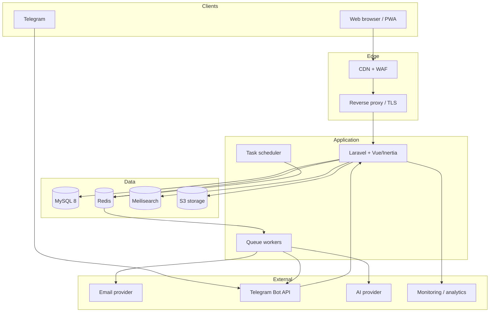

# Техническая архитектура

## 1. Общая схема



## 2. Рекомендуемый стек

| Слой | Технология | Причина |
|---|---|---|
| Backend | PHP 8.3+ / Laravel | Быстрая разработка, зрелые очереди, авторизация, локализация, планировщик |
| Web UI | Vue 3, TypeScript, Inertia.js | Единое приложение без дублирования отдельного API-клиента |
| Styling | Tailwind CSS или существующая дизайн-система | Mobile-first и единообразные компоненты |
| Admin | Filament с отдельными политиками доступа | Быстрое создание безопасных CRUD и рабочих очередей |
| Database | MySQL 8 | Совместимость с выбранной локальной средой, транзакции, JSON, индексы и зрелая поддержка Laravel |
| Cache/Queue | Redis | Кеш, rate limiting, очереди уведомлений и фоновые задания |
| Search | Meilisearch | Быстрые фильтры, опечатки, мультиязычный поиск |
| Files | S3-compatible storage | Масштабируемые видео, документы, изображения и резервирование |
| Infrastructure | Docker Compose; managed VPS/cloud | Повторяемые staging и production среды |
| Observability | Sentry + метрики + централизованные логи | Ошибки, производительность и расследование инцидентов |

Версии библиотек фиксируются lock-файлами. Базовая версия проекта: Laravel 12 на PHP 8.4. Перед установкой остальных библиотек проверяется их совместимость с этой версией.

## 3. Структура приложения

```text
app/
  Modules/
    Identity/
    Profiles/
    Directory/
    Content/
    Learning/
    Events/
    Opportunities/
    Marketplace/
    Mentoring/
    Recommendations/
    Notifications/
    Analytics/
    Moderation/
  Shared/
    Auth/
    Localization/
    Media/
    Audit/
    Support/
resources/
  js/
    pages/
    components/
    layouts/
  lang/
routes/
tests/
```

Каждый модуль содержит модели, действия/use cases, политики доступа, HTTP-обработчики, события, задания очереди и тесты. Модули взаимодействуют через публичные сервисы и доменные события, а не через прямой доступ к внутренним классам.

## 4. Интерфейс и локализация

- язык интерфейса хранится в профиле и может быть изменён в любой момент;
- системные строки находятся в файлах локализации RU/RO/EN;
- редакционный контент хранится в переводимых полях или дочерней таблице `translations`;
- отсутствующий перевод отображается на основном языке с пометкой только в административной зоне;
- даты, числа и названия регионов форматируются по локали;
- публичные URL включают язык: `/ro/events`, `/ru/events`, `/en/events`;
- индексируемые публичные страницы рендерятся на сервере через Inertia SSR; SSR-процесс входит в production-инфраструктуру;
- формы поддерживают клавиатурную навигацию, видимый фокус, контраст и понятные ошибки.

## 5. Авторизация и безопасность

### Аутентификация

- email и пароль с современным адаптивным хешированием;
- подтверждение email;
- восстановление пароля одноразовой ссылкой с коротким сроком жизни;
- опциональная двухфакторная аутентификация для администраторов;
- Telegram не является единственным способом восстановления аккаунта;
- ротация сессии после входа и изменения прав.

### Защита приложения

- CSRF-защита, безопасные cookies, Content Security Policy и TLS;
- rate limiting входа, восстановления пароля, контактов и пользовательских публикаций;
- проверка MIME-типа, размера и расширения файлов; антивирусная проверка при наличии инфраструктуры;
- HTML-очистка пользовательского содержимого;
- политики доступа для каждой сущности;
- журнал административных действий и изменений чувствительных данных;
- секреты только в менеджере секретов или переменных окружения;
- регулярное обновление зависимостей и сканирование уязвимостей.

## 6. Приватность и защита данных

Профиль имеет уровни видимости: `private`, `members`, `public`. Телефон, email и Telegram настраиваются отдельно и по умолчанию скрыты. Связь инициируется через безопасный отклик внутри платформы.

Система хранит:

- версию и дату принятого согласия;
- цель обработки данных;
- источник регистрации;
- историю изменения видимости;
- запросы на экспорт и удаление данных;
- основание и срок хранения служебных записей.

Удаление аккаунта выполняется как управляемый процесс: блокировка входа, отзыв токенов, удаление или обезличивание персональных данных, сохранение минимальных агрегатов для отчётности без возможности повторной идентификации.

## 7. Интеграции

### Telegram

1. Участница в кабинете генерирует одноразовую ссылку.
2. Бот получает токен и связывает `telegram_chat_id` с аккаунтом.
3. Уведомления отправляются только по разрешённым категориям.
4. Команда отключения немедленно прекращает рассылку.
5. Webhook проверяется секретным заголовком; входящие события идемпотентны.

Категории сообщений: события, обучение, возможности, наставничество, запросы по интересам и системная безопасность.

### AI

AI вызывается через интерфейс `AiProvider`, чтобы поставщик мог быть заменён без изменения бизнес-модулей. Внешнему поставщику передаётся минимальный объём данных; контакты и чувствительные поля исключаются. Все AI-ответы маркируются как рекомендации и требуют подтверждения пользователя.

Поддерживаемые задачи:

- улучшение описания бизнеса и короткого питча;
- формулировка запроса или предложения;
- черновой перевод профиля;
- ранжирование кандидатов поверх правил, без автоматического решения;
- объяснение причин рекомендации.

### Email и аналитика

Email отправляется асинхронно с повторными попытками и журналом доставки. Продуктовая аналитика использует псевдонимизированный идентификатор и не получает закрытые поля профиля.

## 8. Фоновые процессы

- отправка уведомлений и дайджестов;
- индексация и удаление записей в поиске;
- обработка изображений и проверка файлов;
- генерация сертификатов;
- истечение событий, возможностей и публикаций;
- пересчёт рекомендаций;
- импорт и экспорт данных;
- сбор агрегированной аналитики;
- очистка временных токенов и устаревших логов.

Все задания должны быть идемпотентными, иметь лимит повторов, backoff и отдельную очередь неуспешных задач.

## 9. Развёртывание

Минимальные среды: `local`, `staging`, `production`. Production включает web-приложение, Inertia SSR-процесс, минимум один worker, scheduler, MySQL 8, Redis, объектное хранилище, TLS и мониторинг.

Pipeline поставки:

1. статический анализ и форматирование;
2. unit и integration tests;
3. сборка frontend;
4. проверка миграций на staging;
5. автоматический deploy образа;
6. миграции с обратимой стратегией;
7. smoke test и проверка очередей.

Резервные копии базы выполняются ежедневно, файлы версионируются, восстановление регулярно тестируется. Целевые показатели первой версии: RPO до 24 часов и RTO до 8 часов; перед запуском они уточняются владельцем продукта.

## 10. Производительность и масштабирование

- пагинация всех списков;
- индексы по статусам, датам, региону, сектору и внешним ключам;
- кеширование публичного контента и справочников;
- CDN для изображений и файлов;
- поиск вынесен в отдельный индекс;
- тяжёлые операции выполняются очередями;
- stateless web-узлы могут масштабироваться горизонтально;
- AI, поиск и уведомления могут быть вынесены в сервисы после появления измеримой нагрузки.
