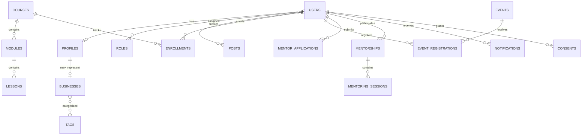

# Модель данных

## 1. Основные связи

## 2. Identity и профиль

### `users`

`id`, `email`, `password_hash`, `status`, `preferred_locale`, `email_verified_at`, `last_login_at`, timestamps.

Статусы аккаунта: `pending_verification`, `active`, `suspended`, `deletion_pending`, `deleted`. Они описывают возможность входа и не заменяют статус модерации профиля.

### `profiles`

`user_id`, имя, фото, город, регион, телефон, Telegram, краткая биография, языки общения, уровень заполнения, статус модерации, уровень видимости, тип участницы и timestamps. Тип участницы различает действующую предпринимательницу, начинающую предпринимательницу и самозанятую.

Статусы модерации: `draft`, `pending_review`, `approved`, `changes_requested`, `rejected`.

Основной переход профиля: `draft → pending_review → approved | changes_requested | rejected`. После исправления профиль со статусом `changes_requested` повторно переходит в `pending_review`. В каталог попадает только профиль активного аккаунта со статусом `approved` и разрешённой видимостью.

### `profile_privacy`

Отдельная настройка видимости для профиля, email, телефона, Telegram, города и бизнес-данных. Значения: `private`, `members`, `public`.

### `businesses`

`profile_id`, название, сектор, описание, товары/услуги, стадия развития, сайт, социальные сети, экспортный интерес, интерес к рынку другого берега, ESG-интерес, «я представляю», timestamps. В первой версии профиль имеет не более одной бизнес-карточки; для начинающей предпринимательницы она необязательна.

### `profile_needs` и `profile_offers`

Нормализованные потребности и предложения с категорией, описанием, тегами, приоритетом и актуальностью. Они используются каталогом и рекомендациями.

## 3. Справочники и география

- `regions`, `cities`;
- `business_sectors`;
- `business_stages`;
- `languages`;
- `expertise_topics`;
- `interest_tags`;
- `opportunity_types`;
- `event_types`.

Справочники переводимы и управляются администратором. Записи не удаляются физически, если уже используются; вместо этого применяется флаг активности.

## 4. Контент

### `content_items`

Общая публикационная сущность: `type`, `status`, `author_id`, `published_at`, `featured` и timestamps. Типы: `page`, `news`, `success_story`, `partner`, `knowledge_base`.

### `content_translations`

`content_item_id`, `locale`, `slug`, `title`, `summary`, `body`, SEO title/description и статус перевода. Уникальные пары: сущность + язык и slug + язык.

### `media`

Метаданные файла: владелец, путь в объектном хранилище, MIME, размер, checksum, статус проверки, альтернативный текст и права использования.

## 5. Обучение

- `courses` — курс, статус, правила завершения, доступность;
- `course_translations` — название и описание по языкам;
- `modules` — порядок модулей;
- `lessons` — видео, текст, файл, ссылка, тест или задание;
- `enrollments` — запись на курс и общий прогресс;
- `lesson_progress` — просмотр, завершение и время;
- `quizzes`, `questions`, `answer_options`, `quiz_attempts` — создаются для курсов, где утверждены правила тестирования;
- `certificates` — номер, дата, шаблон, ссылка проверки;
- `badges`, `user_badges` — опциональны и используются только после утверждения критериев выдачи.

Прогресс рассчитывается сервером, а сертификат генерируется только после выполнения опубликованных правил курса.

## 6. События и возможности

### `events`

Тип, формат, место/ссылка, начало и окончание, вместимость, крайний срок регистрации, организатор, статус и видимость. Переводимые поля находятся в `event_translations` с уникальной парой события и языка.

Статусы: `draft`, `published`, `registration_closed`, `completed`, `cancelled`.

### `event_registrations`

Пользователь, событие, статус, дата регистрации, посещение, источник и комментарий координатора. Уникальность пользователя и события предотвращает дубли.

### `opportunities`

Тип, организатор, география, аудитория, крайний срок, внешняя ссылка, статус и теги. Переводимые поля находятся в `opportunity_translations` с уникальной парой возможности и языка. Просроченные возможности автоматически архивируются.

## 7. Запросы и предложения

### `posts`

`author_id`, `kind` (`request` или `offer`), категория, заголовок, описание, регион, сектор, срок действия, статус модерации, видимость и timestamps.

### `post_responses`

Отклик участницы с сообщением и статусом: `sent`, `viewed`, `accepted`, `declined`, `closed`. Контакты не раскрываются автоматически.

## 8. Наставничество

- `mentor_profiles` — экспертиза, опыт, языки, формат и доступность;
- `mentor_applications` — цель, тема, ожидаемый результат, предпочтения;
- `mentorships` — наставник, участница, координатор, период и статус;
- `mentoring_sessions` — дата, формат, тема, статус и служебная заметка;
- `mentoring_feedback` — оценки и результат, с раздельными публичными и внутренними полями.

Статусы пары: `proposed`, `active`, `paused`, `completed`, `cancelled`.

## 9. Рекомендации и уведомления

### `recommendations`

Получатель, тип объекта, объект, числовой score, коды причин, версия алгоритма, дата создания, срок актуальности, просмотр/скрытие/переход.

### `notifications`

Получатель, категория, канал, шаблон, payload, статус доставки, число попыток, время отправки и ошибка. Содержимое Telegram/email не должно включать закрытые контакты.

### `notification_preferences`

Настройки по категории и каналу, частота (`instant`, `daily`, `weekly`, `off`) и тихие часы.

### Telegram и избранное

- `telegram_connections` — пользователь, `telegram_chat_id`, статус, дата привязки и отключения;
- `telegram_link_tokens` — одноразовый хешированный токен, срок действия и дата использования;
- `favorites` — пользователь, тип объекта и объект; используется для профилей, возможностей и материалов.

## 10. Управление и соответствие

- `roles`, `permissions`, `role_assignments`;
- `moderation_cases` — объект, решение, причина, модератор, timestamps;
- `reports` — жалобы пользователей;
- `audit_logs` — субъект, действие, объект, безопасный diff, IP/контекст;
- `consents` — тип документа, версия, дата, источник;
- `data_requests` — экспорт, исправление или удаление;
- `imports`, `exports` — статус фоновой обработки и файл результата.
- `outbox_messages` — доменное событие, payload, дата публикации и число попыток для надёжной передачи в очереди и интеграции.

Журнал аудита защищён от редактирования обычными администраторами. Чувствительные значения, пароли, токены и полный текст закрытых сообщений в него не записываются.

## 11. Индексы и ограничения

- уникальный индекс на нормализованный email;
- уникальный индекс на `slug + locale` в таблицах переводов публичного контента;
- составные индексы каталога по статусу, региону, сектору и видимости;
- индексы по срокам публикаций, событий и возможностей;
- уникальность регистрации на событие и записи на курс;
- внешние ключи с безопасным поведением при удалении;
- географические, отраслевые и тематические фильтры дублируются в поисковом индексе;
- soft delete применяется только там, где требуется восстановление или аудит.
