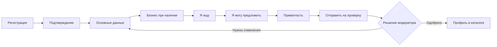
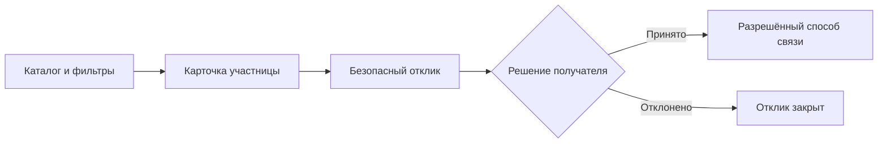
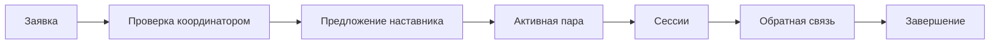

# Карта сайта и кабинета

Документ определяет информационную архитектуру первой версии Women Entrepreneurs Platform. Главный источник продуктовых требований — `2026_Women_Entrepreneurs_Platform.docx`.

## 1. Принципы навигации

- публичный сайт доступен без регистрации и индексируется поисковыми системами;
- публичные URL содержат язык: `/ru`, `/ro`, `/en`;
- кабинет находится в `/app`, а язык интерфейса определяется настройкой пользователя;
- административная зона находится в `/admin` и доступна только по permissions;
- одна учётная запись может иметь несколько ролей;
- закрытые контакты никогда не отображаются без проверки настроек приватности;
- ключевые действия доступны на мобильном экране без горизонтальной прокрутки;
- одинаковые сущности используют одинаковые названия во всех частях платформы.

## 2. Общая карта

```mermaid
flowchart TD
    Root[Women Entrepreneurs Platform]
    Root --> Public[Публичный сайт]
    Root --> Auth[Регистрация и вход]
    Root --> App[Кабинет]
    Root --> Admin[Административная зона]

    Public --> About[О платформе]
    Public --> Project[Проект и партнёры]
    Public --> News[Новости]
    Public --> PublicEvents[События]
    Public --> Opportunities[Возможности]
    Public --> Stories[Истории успеха]
    Public --> Contacts[Контакты]

    App --> Dashboard[Главная кабинета]
    App --> Profile[Профиль и бизнес]
    App --> Directory[Каталог]
    App --> Learning[Обучение]
    App --> MemberEvents[Мои события]
    App --> SavedOpportunities[Сохранённые возможности]
    App --> Marketplace[Запросы и предложения]
    App --> Mentoring[Наставничество]
    App --> Recommendations[Рекомендации]
    App --> Notifications[Уведомления]
    App --> Settings[Настройки]

    Admin --> Users[Пользователи и роли]
    Admin --> Moderation[Модерация]
    Admin --> CMS[Контент и переводы]
    Admin --> AdminLearning[Обучение]
    Admin --> AdminEvents[События]
    Admin --> AdminOpportunities[Возможности]
    Admin --> AdminMentoring[Наставничество]
    Admin --> Messaging[Уведомления]
    Admin --> Reports[Аналитика и отчёты]
    Admin --> Dictionaries[Справочники]
    Admin --> Audit[Аудит]
```

## 3. Публичный сайт

Все маршруты имеют языковой префикс `{locale}` со значениями `ru`, `ro` или `en`.

| Экран | Маршрут | Основное содержание |
|---|---|---|
| Главная | `/{locale}` | Миссия, преимущества, ближайшие события, возможности, истории успеха, партнёры, призыв к регистрации |
| О платформе | `/{locale}/about` | Цели, целевые группы, принцип работы платформы |
| Проект и партнёры | `/{locale}/project` | Донор, реализующая организация, партнёры и вклад организаций |
| Новости | `/{locale}/news` | Список новостей, фильтр по дате и пагинация |
| Новость | `/{locale}/news/{slug}` | Текст, медиа, дата публикации и связанные материалы |
| События | `/{locale}/events` | Календарь и список событий, фильтры по типу, формату и дате |
| Событие | `/{locale}/events/{slug}` | Программа, место или формат, организатор, сроки и регистрация |
| Возможности | `/{locale}/opportunities` | Гранты, программы, выставки, финансирование и экспортная поддержка |
| Возможность | `/{locale}/opportunities/{slug}` | Условия, аудитория, география, дедлайн и внешняя ссылка |
| Истории успеха | `/{locale}/success-stories` | Опубликованные истории предпринимательниц |
| История успеха | `/{locale}/success-stories/{slug}` | История, результаты, фотографии и связанный профиль при согласии |
| Контакты | `/{locale}/contacts` | Контактная форма, email, телефон, социальные сети и Telegram |
| Поиск | `/{locale}/search` | Поиск по доступному публичному контенту |
| Политика конфиденциальности | `/{locale}/privacy` | Актуальная версия политики обработки данных |
| Условия использования | `/{locale}/terms` | Актуальные условия платформы |
| Согласия | `/{locale}/consents` | Перечень действующих юридических документов и версий |

## 4. Регистрация и доступ

| Экран | Маршрут | Назначение |
|---|---|---|
| Регистрация | `/{locale}/register` | Email, пароль, язык, обязательные согласия |
| Подтверждение | `/{locale}/verify` | Подтверждение email или утверждённого Telegram-сценария |
| Вход | `/{locale}/login` | Вход по email и паролю |
| Забытый пароль | `/{locale}/forgot-password` | Запрос одноразовой ссылки |
| Новый пароль | `/{locale}/reset-password/{token}` | Установка нового пароля |
| Начало заполнения | `/app/onboarding` | Польза профиля, приватность, ожидаемое время и переход к пошаговой форме |
| Ожидание модерации | `/app/profile/review` | Статус проверки профиля и замечания модератора |
| Доступ запрещён | `/403` | Объяснение ограничения и безопасный следующий шаг |

Telegram-аутентификация добавляется в эту карту после утверждения отдельного безопасного сценария. Привязка Telegram для уведомлений выполняется внутри кабинета.

## 5. Кабинет участницы

### Главная кабинета

| Экран | Маршрут | Основное содержание |
|---|---|---|
| Обзор | `/app` | Заполнение профиля, ближайшие события, прогресс обучения, рекомендации и важные уведомления |
| Все рекомендации | `/app/recommendations` | Люди, материалы, события, наставники и возможности с объяснением причин |

### Профиль

| Экран | Маршрут | Основное содержание |
|---|---|---|
| Просмотр профиля | `/app/profile` | Вид профиля для владелицы и статус модерации |
| Основные данные | `/app/profile/personal` | Имя, фото, регион, город, биография и языки |
| Бизнес-карточка | `/app/profile/business` | «Я представляю», сектор, стадия, продукты и ссылки; необязательно для начинающей предпринимательницы |
| Потребности | `/app/profile/needs` | «Я ищу», темы, рынки, обучение, финансирование и экспертиза |
| Предложения | `/app/profile/offers` | «Я могу предложить», услуги, товары, опыт и наставничество |
| Предпросмотр | `/app/profile/preview` | Вид карточки для гостя и зарегистрированной участницы |
| Отправка на проверку | `/app/profile/submit` | Проверка обязательных полей и подтверждение отправки |

### Каталог предпринимательниц

| Экран | Маршрут | Основное содержание |
|---|---|---|
| Каталог | `/app/directory` | Поиск и фильтры по региону, сектору, стадии, интересам, потребностям и языкам |
| Карточка участницы | `/app/directory/{profile}` | Разрешённые данные, бизнес, потребности, предложения и безопасный отклик |
| Избранные профили | `/app/directory/favorites` | Сохранённые карточки предпринимательниц |

### Обучение

| Экран | Маршрут | Основное содержание |
|---|---|---|
| Каталог обучения | `/app/learning` | Курсы и материалы базы знаний |
| Курс | `/app/learning/courses/{course}` | Описание, программа, правила завершения и прогресс |
| Урок | `/app/learning/lessons/{lesson}` | Видео, текст, файл, ссылка, тест или задание |
| Мои курсы | `/app/learning/my-courses` | Активные и завершённые курсы |
| Сертификаты | `/app/learning/certificates` | Выданные сертификаты и ссылки проверки |
| Материал базы знаний | `/app/knowledge/{material}` | Практическое руководство, шаблон или запись вебинара |

### События и возможности

| Экран | Маршрут | Основное содержание |
|---|---|---|
| События | `/app/events` | Доступные события и персональные рекомендации |
| Событие | `/app/events/{event}` | Детали и регистрация с учётом лимита мест |
| Мои регистрации | `/app/events/my` | Будущие, завершённые и отменённые регистрации |
| Возможности | `/app/opportunities` | Возможности с расширенными фильтрами и рекомендациями |
| Возможность | `/app/opportunities/{opportunity}` | Детали, дедлайн, сохранение и переход к организатору |
| Сохранённые возможности | `/app/opportunities/saved` | Избранные возможности и предупреждения о дедлайне |

### Запросы и предложения

| Экран | Маршрут | Основное содержание |
|---|---|---|
| Лента | `/app/posts` | Опубликованные запросы и предложения с фильтрами |
| Публикация | `/app/posts/{post}` | Содержание, автор, срок и безопасный отклик |
| Создание | `/app/posts/create` | Тип, категория, регион, сектор, текст и срок действия |
| Редактирование | `/app/posts/{post}/edit` | Изменение черновика или публикации по правилам модерации |
| Мои публикации | `/app/posts/my` | Черновики, проверка, опубликованные, закрытые и отклонённые записи |
| Полученные отклики | `/app/posts/{post}/responses` | Отклики без автоматического раскрытия скрытых контактов |

### Наставничество

| Экран | Маршрут | Основное содержание |
|---|---|---|
| Наставники | `/app/mentors` | Каталог экспертов по темам, языкам и доступности |
| Профиль наставника | `/app/mentors/{mentor}` | Экспертиза, опыт, формат и доступность |
| Заявка | `/app/mentoring/apply` | Цель, тема, ожидаемый результат и предпочтения |
| Мои заявки | `/app/mentoring/applications` | Статусы заявок и решения координатора |
| Моя пара | `/app/mentoring/{mentorship}` | Наставник, период, план и сессии |
| Сессия | `/app/mentoring/{mentorship}/sessions/{session}` | Дата, формат, тема и разрешённые заметки |
| Обратная связь | `/app/mentoring/{mentorship}/feedback` | Структурированная оценка результата |

### Уведомления и настройки

| Экран | Маршрут | Основное содержание |
|---|---|---|
| Центр уведомлений | `/app/notifications` | Внутренние уведомления и отметка прочтения |
| Каналы и частота | `/app/settings/notifications` | Email, Telegram, категории, частота и тихие часы |
| Приватность | `/app/settings/privacy` | Видимость профиля и отдельных контактных полей |
| Язык | `/app/settings/language` | RU, RO или EN |
| Безопасность | `/app/settings/security` | Пароль, активные сессии и Telegram-привязка |
| Согласия | `/app/settings/consents` | Принятые версии и изменение необязательных согласий |
| Мои данные | `/app/settings/data` | Запрос экспорта, исправления или удаления данных |

## 6. Дополнительные ролевые разделы кабинета

### Наставница или эксперт

| Экран | Маршрут |
|---|---|
| Профессиональный профиль | `/app/expert/profile` |
| Темы и форматы работы | `/app/expert/expertise` |
| Доступность | `/app/expert/availability` |
| Активные пары | `/app/expert/mentorships` |
| Сессии | `/app/expert/sessions` |
| Обратная связь | `/app/expert/feedback` |

### Представитель партнёра

Партнёр не публикует материалы напрямую. Он передаёт их через редакционный процесс.

| Экран | Маршрут |
|---|---|
| Мои материалы | `/app/partner/submissions` |
| Предложить событие | `/app/partner/submissions/events/create` |
| Предложить возможность | `/app/partner/submissions/opportunities/create` |
| Предложить материал | `/app/partner/submissions/content/create` |

## 7. Административная зона

Административная зона реализуется на Filament. Видимые разделы определяются permissions.

| Раздел | Маршрут | Доступ |
|---|---|---|
| Обзор | `/admin` | Администраторы и разрешённые аналитики |
| Пользователи | `/admin/users` | Суперадминистратор, модератор в пределах полномочий |
| Роли и permissions | `/admin/access` | Суперадминистратор |
| Профили на проверке | `/admin/moderation/profiles` | Модератор |
| Публикации на проверке | `/admin/moderation/posts` | Модератор |
| Жалобы | `/admin/moderation/reports` | Модератор |
| Страницы и новости | `/admin/content` | Редактор |
| Истории успеха | `/admin/success-stories` | Редактор |
| Партнёры | `/admin/partners` | Редактор |
| Переводы | `/admin/translations` | Редактор соответствующего языка |
| Медиа | `/admin/media` | Редактор с ограничениями загрузки |
| Курсы | `/admin/learning/courses` | Редактор обучения |
| Материалы базы знаний | `/admin/learning/knowledge` | Редактор обучения |
| Сертификаты | `/admin/learning/certificates` | Редактор обучения или администратор |
| События и регистрации | `/admin/events` | Редактор или координатор |
| Возможности | `/admin/opportunities` | Редактор |
| Наставники и заявки | `/admin/mentoring` | Координатор наставничества |
| Пары и сессии | `/admin/mentoring/matches` | Координатор наставничества |
| Шаблоны уведомлений | `/admin/notifications/templates` | Администратор |
| Рассылки | `/admin/notifications/campaigns` | Разрешённый редактор или администратор |
| Справочники | `/admin/dictionaries` | Суперадминистратор |
| Аналитика | `/admin/analytics` | Аналитик с обезличенными данными |
| Экспорт | `/admin/exports` | Только отдельное permission |
| Журнал аудита | `/admin/audit` | Суперадминистратор, только чтение |
| Интеграции | `/admin/settings/integrations` | Суперадминистратор без отображения секретов |

## 8. Основные пользовательские переходы

### Регистрация и публикация профиля

### Поиск делового контакта

### Наставничество

## 9. Приоритет макетов

### P0 — до начала основной разработки

1. главная публичного сайта;
2. регистрация и подтверждение;
3. вход и восстановление пароля;
4. мастер заполнения профиля;
5. главная кабинета;
6. каталог и фильтры;
7. карточка участницы;
8. курс и урок;
9. событие и регистрация;
10. создание запроса или предложения;
11. заявка на наставничество;
12. очередь модерации профилей.

### P1 — до функционального beta-релиза

- возможности и сохранённые материалы;
- отклики на публикации;
- наставническая пара и сессии;
- уведомления и настройки каналов;
- приватность и запросы по данным;
- CMS, события, обучение и аналитика в административной зоне.

### P2 — после проверки основных сценариев

- расширенные рекомендации;
- тесты, задания и бейджи;
- партнёрские формы передачи материалов;
- расширенные отчёты и кампании.

## 10. Навигация кабинета

Основная мобильная навигация содержит не более пяти пунктов:

1. Главная;
2. Каталог;
3. Обучение;
4. Активности;
5. Профиль.

«Активности» объединяют события, возможности, запросы/предложения и наставничество. На широком экране эти разделы раскрываются как отдельные пункты бокового меню. Уведомления доступны из шапки, настройки — из меню профиля.

## 11. Следующий дизайн-артефакт

На основе этой карты создаётся user flow регистрации и заполнения профиля, затем мобильные wireframes экранов P0. Визуальные цвета и декоративный стиль применяются только после проверки структуры и сценариев.
