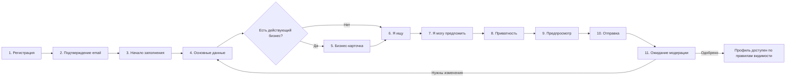

# Wireframes регистрации и заполнения профиля

Документ описывает первый P0-сценарий из карты сайта: создание аккаунта, подтверждение контакта, заполнение профиля и отправку на модерацию.

## 1. Цель сценария

Пользователь должен:

1. создать и подтвердить аккаунт;
2. понять пользу профиля и правила видимости;
3. заполнить данные без перегрузки длинной формой;
4. проверить будущий вид карточки;
5. отправить профиль на модерацию;
6. видеть статус и замечания после отправки.

Создание аккаунта не означает публикацию профиля. Доступ в каталог появляется только у активного аккаунта с одобренным профилем и разрешённой видимостью.

## 2. Полный flow



## 3. Общий каркас onboarding

### Мобильный экран

```text
┌──────────────────────────────┐
│ Logo                    RU ▾ │
├──────────────────────────────┤
│ Шаг 2 из 6                  │
│ ████████░░░░░░░░░░  33%     │
│                              │
│ Заголовок шага               │
│ Короткое объяснение          │
│                              │
│ [ Поле / элемент формы     ] │
│ [ Поле / элемент формы     ] │
│                              │
│ Сообщение об автосохранении  │
│                              │
│ [Назад]   [Сохранить и далее]│
└──────────────────────────────┘
```

### Широкий экран

```text
┌──────────────────────────────────────────────────────────────┐
│ Logo                                             RU ▾  Помощь│
├───────────────────┬──────────────────────────────────────────┤
│ ✓ Основные данные │ Заголовок шага                           │
│ • Бизнес          │ Короткое объяснение                      │
│ ○ Я ищу           │                                          │
│ ○ Я предлагаю     │ [ Основная форма                       ] │
│ ○ Приватность     │ [                                      ] │
│ ○ Проверка        │                                          │
│                   │ Сохранено 14:32                          │
│                   │                     [Назад] [Далее]      │
└───────────────────┴──────────────────────────────────────────┘
```

Правила каркаса:

- прогресс показывает смысловые шаги профиля, а не регистрацию и подтверждение;
- данные сохраняются после успешной валидации поля и при переходе далее;
- кнопка «Назад» не удаляет введённые данные;
- необязательный шаг имеет явное действие «Пропустить»;
- выход из onboarding разрешён, продолжение доступно с главной кабинета;
- ошибки отображаются рядом с полем и сводкой в начале формы;
- фокус после ошибки переводится на первое невалидное поле.

## 4. Экран регистрации

Маршрут: `/{locale}/register`.

```text
┌──────────────────────────────┐
│ Logo                    RU ▾ │
│                              │
│ Создайте аккаунт             │
│ Уже зарегистрированы? Войти  │
│                              │
│ Email *                      │
│ [ name@example.com         ] │
│                              │
│ Пароль *                     │
│ [ •••••••••••          👁  ] │
│ Не менее 10 символов         │
│                              │
│ Язык интерфейса *            │
│ [ Русский                  ▾] │
│                              │
│ ☐ Принимаю Условия *         │
│ ☐ Принимаю Политику *        │
│ ☐ Хочу получать новости      │
│                              │
│ [      Создать аккаунт     ] │
└──────────────────────────────┘
```

Поля и правила:

| Поле | Обязательность | Правило |
|---|---|---|
| Email | Да | Нормализуется, проверяется формат и уникальность |
| Пароль | Да | Минимум 10 символов; проверяется по правилам Laravel Password |
| Язык интерфейса | Да | `ru`, `ro` или `en`; по умолчанию язык текущей страницы |
| Условия использования | Да | Сохраняются тип, версия, дата и источник согласия |
| Политика конфиденциальности | Да | Сохраняются тип, версия, дата и источник согласия |
| Новости и кампании | Нет | Отдельное отзывное согласие, выключено по умолчанию |

Требования:

- не сообщать, зарегистрирован ли чужой email, в сценарии восстановления пароля;
- ссылки на юридические документы открываются без потери формы;
- кнопка блокируется только во время отправки запроса;
- двойная отправка не создаёт второй аккаунт;
- после успеха выполняется переход на экран подтверждения.

## 5. Подтверждение email

Маршрут: `/{locale}/verify`.

```text
┌──────────────────────────────┐
│ Подтвердите email            │
│                              │
│ Мы отправили письмо на       │
│ pa•••@example.com            │
│                              │
│ [Открыть почтовое приложение]│
│                              │
│ Не получили письмо?          │
│ Отправить повторно через 00:42│
│                              │
│ Изменить email               │
└──────────────────────────────┘
```

Состояния:

- письмо отправлено;
- повторная отправка временно недоступна;
- ссылка просрочена;
- ссылка уже использована;
- email успешно подтверждён;
- email изменён и требует нового подтверждения.

## 6. Начало заполнения

Маршрут: `/app/onboarding`.

```text
┌──────────────────────────────┐
│ Добро пожаловать             │
│                              │
│ Профиль поможет находить:    │
│ ✓ партнёров и клиентов       │
│ ✓ обучение и события         │
│ ✓ наставников и возможности  │
│                              │
│ Вы сами управляете тем,      │
│ кому видны ваши контакты.    │
│                              │
│ Заполнение: около 8 минут    │
│                              │
│ [     Начать заполнение    ] │
│ Заполнить позже              │
└──────────────────────────────┘
```

Экран не запрашивает данные. Он объясняет ценность, длительность и принцип приватности.

## 7. Шаг «Основные данные»

Маршрут: `/app/profile/personal`.

| Поле | Обязательность | Комментарий |
|---|---|---|
| Имя | Да | Отображается согласно выбранной видимости профиля |
| Фамилия | Да | Может быть скрыта от гостей отдельным продуктовым решением |
| Тип участницы | Да | Действующая предпринимательница, начинающая предпринимательница, самозанятая |
| Регион | Да | Значение из управляемого справочника |
| Город или населённый пункт | Да | Зависит от региона; допускается уточнение вручную по утверждённым правилам |
| Языки общения | Да | Можно выбрать несколько языков |
| Краткая биография | Нет | Ограничение длины и безопасный plain text |
| Фото | Нет | Предпросмотр, ограничения MIME/размера, возможность удалить |
| Телефон | Нет | Хранится отдельно от настройки видимости |

После выбора типа участницы система определяет, обязателен ли переход к бизнес-карточке. Для начинающей предпринимательницы он необязателен.

## 8. Шаг «Бизнес-карточка»

Маршрут: `/app/profile/business`.

```text
┌──────────────────────────────┐
│ Расскажите о бизнесе         │
│                              │
│ Название *                   │
│ [                          ] │
│ Сектор *                     │
│ [ Выберите                ▾] │
│ Стадия развития *            │
│ [ Выберите                ▾] │
│                              │
│ Что вы представляете? *      │
│ [                          ] │
│ [                          ] │
│ 180 / 500                    │
│                              │
│ Товары или услуги            │
│ [ + Добавить               ] │
│                              │
│ Сайт и социальные сети       │
│ [                          ] │
│                              │
│ [Назад]             [Далее]  │
└──────────────────────────────┘
```

Дополнительные признаки:

- интерес к экспорту;
- интерес к рынку другого берега;
- интерес к ESG и устойчивому бизнесу;
- готовность участвовать в партнёрских программах.

В первой версии профиль содержит не более одной бизнес-карточки.

## 9. Шаг «Я ищу»

Маршрут: `/app/profile/needs`.

Пользователь выбирает одну или несколько потребностей:

- обучение;
- наставник или эксперт;
- партнёры;
- поставщики;
- клиенты и новые рынки;
- финансирование или гранты;
- экспорт;
- маркетинг и продажи;
- юридическая или административная помощь;
- цифровизация;
- ESG;
- другое.

Для каждой выбранной потребности можно указать короткое пояснение и приоритет. Потребности профиля не являются публикациями раздела «Запросы и предложения» и не имеют публичного дедлайна.

## 10. Шаг «Я могу предложить»

Маршрут: `/app/profile/offers`.

Пользователь выбирает категории предложения и при необходимости добавляет описание:

- товары;
- профессиональные услуги;
- консультации;
- наставничество;
- партнёрство;
- обучение или мастер-классы;
- доступ к рынкам или деловым контактам;
- другое.

Пустой список допустим для начинающей предпринимательницы. Интерфейс объясняет, что данные можно дополнить позднее.

## 11. Шаг «Приватность»

Маршрут: `/app/settings/privacy`; в onboarding открывается в контексте пошагового заполнения.

```text
┌────────────────────────────────────┐
│ Кто может видеть ваши данные?      │
│                                    │
│ Профиль     ( ) Только я           │
│             (•) Участницы          │
│             ( ) Все в интернете    │
│                                    │
│ Email        [ Только я          ▾] │
│ Телефон      [ Только я          ▾] │
│ Telegram     [ Только я          ▾] │
│ Город        [ Участницы         ▾] │
│ Бизнес       [ Все в интернете   ▾] │
│                                    │
│ i Скрытые контакты не передаются   │
│   в уведомлениях и поисковый индекс│
│                                    │
│ [Назад]                   [Далее]  │
└────────────────────────────────────┘
```

Значения: `private`, `members`, `public`. Безопасные значения по умолчанию:

| Данные | Значение по умолчанию |
|---|---|
| Профиль | `members` |
| Email | `private` |
| Телефон | `private` |
| Telegram | `private` |
| Город | `members` |
| Бизнес-данные | `members` |

Если профиль установлен как `private`, отдельные поля не могут фактически получить более широкую видимость.

## 12. Предпросмотр и отправка

Маршрут: `/app/profile/preview`.

Экран содержит:

- переключатель «вид для гостя / вид для участницы»;
- карточку профиля с фактически разрешёнными полями;
- список незаполненных обязательных данных;
- предупреждение о предварительной модерации;
- ссылки редактирования каждого блока;
- кнопку «Отправить на проверку».

После отправки:

- профиль переходит из `draft` в `pending_review`;
- редактирование модерируемых полей блокируется либо создаёт новую ревизию — механизм утверждается до реализации;
- пользователю отправляется внутреннее уведомление и разрешённое email/Telegram-уведомление;
- повторная отправка того же состояния идемпотентна.

## 13. Ожидание и результат модерации

Маршрут: `/app/profile/review`.

### Ожидание

```text
┌──────────────────────────────┐
│ Профиль отправлен на проверку│
│                              │
│ Статус: На рассмотрении      │
│ Отправлен: 22.06.2026, 14:32 │
│                              │
│ Пока можно изучать обучение, │
│ события и возможности.       │
│                              │
│ [Перейти в кабинет]          │
└──────────────────────────────┘
```

### Нужны изменения

Экран показывает структурированный список замечаний, общий комментарий модератора и кнопки перехода к соответствующим блокам. После исправления профиль повторно отправляется на проверку.

### Одобрено

Экран сообщает фактическую видимость профиля и предлагает открыть карточку в каталоге. Одобрение не должно автоматически менять выбранные пользователем настройки приватности.

## 14. Состояния сохранения

Каждый шаг поддерживает состояния:

- начальная загрузка;
- пустая форма;
- заполненная форма;
- локальное изменение;
- сохранение;
- успешно сохранено;
- ошибка валидации;
- временная ошибка сервера с повтором;
- конфликт версии при редактировании в двух вкладках;
- недоступность шага из-за статуса модерации.

Пароль, токены и значения согласий не сохраняются в браузерный draft. Остальные незавершённые поля могут храниться только в рамках безопасной серверной сессии или подтверждённого аккаунта.

## 15. Доступность и локализация

- каждый input имеет постоянный label;
- обязательность обозначается текстом, а не только цветом;
- ошибки связаны с полями через ARIA-атрибуты;
- порядок Tab соответствует визуальному порядку;
- кнопки имеют минимальную удобную область нажатия 44×44 px;
- прогресс понятен без восприятия цвета;
- тексты допускают увеличение длины минимум на 30% для переводов;
- имена, названия бизнеса и пользовательские тексты не переводятся автоматически без согласия;
- даты отображаются по локали, но передаются и хранятся в UTC.

## 16. События аналитики

Аналитика не получает введённые персональные данные. Допустимые события:

- `registration_started`;
- `registration_completed`;
- `email_verified`;
- `onboarding_started`;
- `onboarding_step_viewed` с кодом шага;
- `onboarding_step_completed` с кодом шага;
- `onboarding_abandoned` с кодом последнего шага;
- `profile_submitted`;
- `profile_changes_requested`;
- `profile_approved`.

## 17. Критерии готовности дизайна

Wireframe считается готовым к визуальному дизайну, когда:

1. все обязательные поля подтверждены владельцем продукта;
2. определены тексты трёх языков или правила временного контента;
3. согласованы безопасные настройки приватности по умолчанию;
4. согласован сценарий редактирования во время модерации;
5. проверен мобильный flow шириной 320 px;
6. пользователь может вернуться и продолжить заполнение;
7. начинающая предпринимательница проходит flow без бизнес-карточки;
8. ошибки и недоступность внешних каналов имеют понятный fallback;
9. прототип проверен минимум на представительницах основных целевых групп.

## 18. Следующий дизайн-артефакт

После утверждения этого flow создаются визуальные wireframes главной страницы кабинета, каталога и карточки участницы. Они используют данные и состояния профиля, определённые в этом документе.
