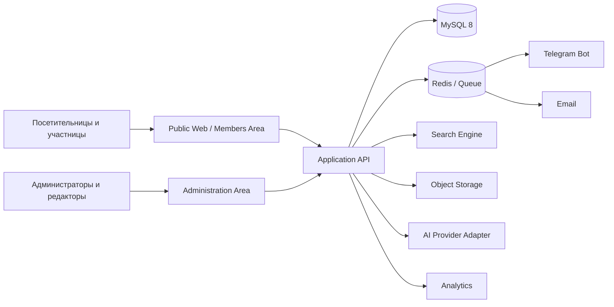

# Архитектура Women Entrepreneurs Platform

Документация подготовлена на основе плана `2026_Women_Entrepreneurs_Platform.docx`.

## Приоритет документов

`2026_Women_Entrepreneurs_Platform.docx` является главным источником продуктовых требований. Markdown-документы раскрывают и технически уточняют исходный план, но не могут сокращать или изменять его цели, целевые группы, основные функции, показатели и этапы без отдельного согласованного решения.

Если между документами обнаружено расхождение, применяется следующий порядок:

1. утверждённое изменение к исходному плану;
2. `2026_Women_Entrepreneurs_Platform.docx`;
3. продуктовая архитектура;
4. техническая архитектура, модель данных и план реализации.

## Цель продукта

Создать долгосрочную трёхъязычную цифровую экосистему как минимум для 500 женщин с двух берегов: действующих и начинающих предпринимательниц, самозанятых, владелиц микро-, малых и средних предприятий, а также наставников, экспертов, тренеров и партнёрских организаций. Платформа объединяет обучение, каталог бизнеса, деловые связи, запросы и предложения, наставничество, события, возможности, Telegram-коммуникацию и AI-поддерживаемые рекомендации.

## Архитектурный подход

Для первой версии рекомендуется **модульный монолит**: единое серверное приложение с изолированными бизнес-модулями, общей базой данных и очередями фоновых задач. Такой подход быстрее и дешевле в разработке и сопровождении, чем микросервисы, но позволяет позднее вынести поиск, уведомления или AI в отдельные сервисы.

## Документы

- [01-product-architecture.md](01-product-architecture.md) — роли, разделы, пользовательские сценарии и границы первой версии.
- [02-technical-architecture.md](02-technical-architecture.md) — компоненты, рекомендуемый стек, безопасность, интеграции и развёртывание.
- [03-data-model.md](03-data-model.md) — сущности, связи, статусы и правила видимости данных.
- [04-api-and-delivery.md](04-api-and-delivery.md) — API, этапы реализации, контроль качества и критерии приёмки.
- [05-information-architecture.md](05-information-architecture.md) — карта публичного сайта, кабинета, административной зоны и приоритет экранов.
- [06-registration-profile-wireframes.md](06-registration-profile-wireframes.md) — flow, поля и wireframes регистрации, профиля, приватности и модерации.
- [07-visual-design-system.md](07-visual-design-system.md) — визуальная концепция, дизайн-токены, компоненты и правила доступности.
- [08-image-assets.md](08-image-assets.md) — generated-фотографии, prompts, оптимизация и ограничения использования.

## Основные решения

| Область | Решение |
|---|---|
| Интерфейс | mobile-first, RU/RO/EN, доступность WCAG 2.1 AA |
| Backend | Laravel, модульная структура, REST API |
| Frontend | Vue 3 + Inertia.js; SSR для индексируемых публичных страниц |
| Данные | MySQL 8, Redis для кеша и очередей |
| Поиск | Meilisearch; до его подключения допустим MySQL Full-Text Search |
| Файлы | S3-совместимое объектное хранилище |
| Авторизация | email/password; Telegram-аутентификация или подтверждение после отдельного утверждения сценария |
| Уведомления | очередь задач, email, Telegram, сообщения внутри платформы |
| AI | отдельный отключаемый адаптер; поиск, рекомендации и помощь с текстом без автоматических решений |
| Развёртывание | Docker, staging и production, автоматические резервные копии |

## Границы первой версии

В первую финансируемую версию входят публичный сайт, регистрация и личный кабинет, профиль и каталог, обучение и база знаний, события, возможности, запросы/предложения, наставничество, Telegram-коммуникация, AI-поддерживаемый поиск и рекомендации, администрирование, защита данных и аналитика. До накопления достаточного объёма качественных данных рекомендации используют прозрачные правила; AI подключается постепенно через отключаемый адаптер и не заменяет модерацию или решение пользователя.
